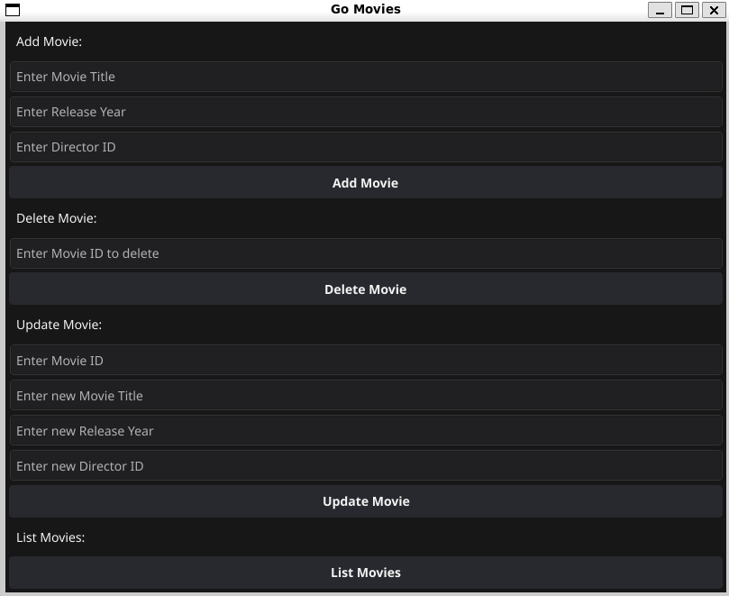

# Distributed SQL Databases with Kubernetes

This project demonstrates how to set up and manage distributed SQL databases using Kubernetes, with a focus on concurrency and isolation levels.

## Overview

This project aims to provide a practical understanding of distributed SQL databases, how they can be managed using Kubernetes, and how concurrency and isolation levels can be handled in SQL databases.

## Features

- **Distributed SQL Databases**: Learn how to set up and manage distributed SQL databases.
- **Kubernetes**: Understand how Kubernetes can be used to manage your databases.
- **Concurrency**: Explore how concurrent transactions can be handled in SQL databases.
- **Isolation Levels**: Learn about different isolation levels in SQL databases and how they affect concurrency.

## Getting Started

These instructions will get you a copy of the project up and running on your local machine for development and testing purposes.

### Prerequisites

- Docker
- Kubernetes
- Go

### Installation

```bash
./build.sh
```

### Usage

```bash
go run main.go
```

#### Run the concurrency test

```bash
go run main.go -concurrency
```

## Contributing

Please read [CONTRIBUTING.md](CONTRIBUTING.md) for details on our code of conduct, and the process for submitting pull requests to us.

## Documentation

### Database

The database used in this project is Postgres spun up as a distributed database using docker compose and citus with two workers. The connection to the database is made in database/connection.go where Connect() returns an instance of \*sql.DB.

### Repository

The repository pattern is used to interact with the database. The repository interface is defined in repository/repository.go and the implementation is in repository/$entityrepository.go. The repository is used to interact with the database and perform CRUD operations.

### Entities

The entities are defined in entity/$entity.go. The entities are used to represent the data in the database and are used by the repository to interact with the database.

### Controller

The controller is interacts with the repository to provide an interface for the client to interact with the database. The controller is defined in controller/controller.go and the implementation is in controller/$entitycontroller.go. The controller is used to handle the business logic and interact with the repository and also return the data from the database in a format that the client can use, in this case returning objects or arrays of objects.

### GUI

The graphical user interface is written using the Fyne library and has a few options for the user to interact with the database. You have options for listing adding deleting and updating the entities in the database. The GUI is also the default option for the program.



### CLI

The command line interface is written using the stdlib "flag" package and implements the "--concurrency" flag which disables the GUI and only runs the concurrency test.

### Building

The build.sh script is used to build the project. The script compiles the Go code and creates a binary in the bin/ directory, it also versions the binary using the latest git commit hash.

## Docker

The docker compose file is used to spin up the database containers and the database is initialized using the init.sql file. The database is exposed on port 5432.
